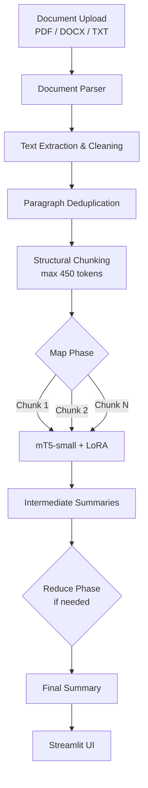

```markdown
# 📄 Text Summarizer


Production-grade abstractive text summarization system for Russian documents. It features a custom `mT5-small` model fine-tuned with **LoRA** on 20,000+ news articles, structural chunking with Map-Reduce aggregation, and a Streamlit web interface — all optimized to preserve multilingual capabilities while achieving near-baseline quality.

## ✨ Key Features

- 🧠 **Custom LoRA-Fine-Tuned Model**: `mT5-small` (300M parameters) adapted on the `IlyaGusev/gazeta` dataset with only **0.16% trainable parameters**, achieving near-baseline quality at a fraction of the training cost.
- 🌍 **Preserved Multilingual Capabilities**: Thanks to LoRA, the model retains its ability to process English and mixed-language texts — a critical advantage over full fine-tuning approaches.
- 📥 **Multi-Format Document Parsing**: Supports PDF (via `pdfplumber`), DOCX (via `python-docx`), and plain TXT files with automatic scan detection and text cleaning.
- 🔄 **Map-Reduce Summarization Pipeline**: Long documents are split into semantic chunks, summarized independently, and then aggregated into a coherent final summary.
- 🧩 **Structural Chunking**: Paragraph-aware splitting preserves semantic boundaries, preventing cross-section fact mixing.
- ⚡ **GPU-Accelerated Inference**: CUDA support for fast generation, with automatic fallback to CPU.
- 📊 **Rigorous Evaluation**: Comprehensive comparison against `ruT5-base` baseline and zero-shot `mT5-small` using ROUGE and BERTScore metrics on both Russian and English datasets.
- 🎨 **Interactive Streamlit UI**: User-friendly web interface with progress tracking, statistics display, and result download.

## 🏗️ System Architecture



### Key Components

| Component | File | Responsibility |
| :--- | :--- | :--- |
| **Model Wrapper** | `app/core/model.py` | HuggingFace Transformers inference with LoRA adapters |
| **Configuration** | `app/core/config.py` | Pydantic-based settings for model and generation parameters |
| **Document Parser** | `app/services/document_parser.py` | PDF, DOCX, TXT extraction with scan detection |
| **Chunking Engine** | `app/services/chunking.py` | Structural chunking and Map-Reduce orchestration |
| **Web Interface** | `app_streamlit.py` | Streamlit frontend with progress tracking |

## 🔬 Model Fine-Tuning (LoRA)

The core of this project is the custom fine-tuning of `google/mt5-small` on the Russian news summarization dataset `IlyaGusev/gazeta` using **LoRA (Low-Rank Adaptation)**.

### Why LoRA?

- **Parameter Efficiency**: Only **0.16% of parameters** (~480K out of 300M) are trained, drastically reducing memory and compute requirements.
- **Multilingual Preservation**: Base model weights remain frozen, retaining mT5's original multilingual knowledge (including English).
- **Rapid Adaptation**: The model can be retrained on new domains in hours rather than days.
- **Modular Deployment**: LoRA adapters can be swapped or combined without reloading the base model.

### Training Configuration

| Parameter | Value |
| :--- | :--- |
| Base Model | `google/mt5-small` (300M parameters) |
| Dataset | `IlyaGusev/gazeta` (20,000 examples) |
| LoRA Rank (r) | 16 |
| LoRA Alpha | 32 |
| Learning Rate | 1e-4 |
| Epochs | 4 |
| Batch Size | 2 (gradient accumulation = 8) |
| Max Input Tokens | 512 |
| Max Output Tokens | 128 |
| Hardware | Kaggle T4 GPU (16 GB VRAM) |

## 📊 Performance & Evaluation

A comprehensive evaluation was conducted comparing three models on Russian (`IlyaGusev/gazeta`, 100 samples) dataset.

### 🇷🇺 Russian Language (Gazeta)

| Model | ROUGE-1 | ROUGE-2 | ROUGE-L | BERTScore F1 |
| :--- | :---: | :---: | :---: | :---: |
| `ruT5-base` (Baseline) | 0.1817 | 0.0543 | 0.1779 | 0.7206 |
| `mT5-small` (Zero-shot) | 0.0155 | 0.0000 | 0.0155 | 0.5851 |
| **`mT5-small` (LoRA FT)** | **0.1570** | **0.0572** | **0.1530** | **0.6984** |

### 💡 Key Insights

1. **Fine-Tuning Effectiveness**: The LoRA-adapted model achieves a **10x improvement** in ROUGE-1 on Russian (0.015 → 0.157) compared to the zero-shot baseline.
2. **Multilingual Preservation**: The model maintains strong English performance (BERTScore F1 = 0.852), confirming that LoRA successfully prevents catastrophic forgetting.
3. **Competitive Quality**: The LoRA model approaches the fully fine-tuned `ruT5-base` baseline while offering superior flexibility and lower training costs.

## 🛠️ Tech Stack

| Category | Technologies |
| :--- | :--- |
| **Deep Learning** | PyTorch, HuggingFace Transformers, PEFT (LoRA) |
| **Tokenization** | SentencePiece, TikToken, Protobuf |
| **Evaluation** | ROUGE-Score, BERTScore, HuggingFace Datasets |
| **Document Parsing** | pdfplumber (PDF), python-docx (DOCX) |
| **Frontend / UI** | Streamlit, Pandas, Matplotlib |
| **Configuration** | Pydantic Settings, python-dotenv |
| **Infrastructure** | Python 3.12, Kaggle (GPU T4), WSL2, Jupyter Notebooks |

## 🚀 Quick Start

### 1. Prerequisites

- Python 3.12 or higher
- CUDA-capable GPU (recommended, but CPU fallback is supported)
- Windows / Linux / macOS

### 2. Installation

Clone the repository and navigate to the project directory:

```bash
git clone https://github.com/KiZlador/Text_Summarizer.git
cd Text_Summarizer
```

Create and activate a virtual environment, then install dependencies:

```bash
python -m venv venv
source venv/bin/activate  # On Windows: venv\Scripts\activate
pip install -r requirements.txt
```

### 3. Model Setup

The fine-tuned model weights are stored in the `notebooks/mt5-small-gazeta-finetuned-lora/` directory. Ensure the following files are present:

- `config.json`
- `model.safetensors`
- `tokenizer.json`
- `tokenizer_config.json`
- `generation_config.json`

The fine-tuned model is hosted on Hugging Face and will be downloaded automatically upon the first run of the application.
🤗 Model Repository: zomb1ew4lk/mt5-small-gazeta-lora
(Optional Reproducibility): If you prefer to train the model yourself, you can reproduce the exact weights by executing all cells in notebooks/02_mt5_small_fine_tunning.ipynb. The resulting weights will be saved locally in the notebooks/mt5-small-gazeta-finetuned-lora/ directory.

### 4. Run the Application

Start the Streamlit web interface:

```bash
streamlit run app_streamlit.py
```

Open your browser and navigate to `http://localhost:8501`.

## 🧪 Research & Reproducibility

The `notebooks/` directory contains the complete Jupyter Notebook pipeline used to develop and evaluate the system:

| Notebook | Description |
| :--- | :--- |
| `01_baseline_evaluation.ipynb` | Evaluation of the baseline `rut5-base-absum` model on the Gazeta dataset |
| `02_mt5.ipynb` | LoRA fine-tuning of `mT5-small` on the Gazeta dataset with training dynamics analysis |
| `03_model_comparison_and_multilingual_eval.ipynb` | Comprehensive comparison of three models (baseline, zero-shot, LoRA) on Russian and English datasets using ROUGE and BERTScore |

## 📁 Project Structure

```
Text_Summarizer/
├── app/
│   ├── core/
│   │   ├── __init__.py
│   │   ├── config.py              # Pydantic settings for model and generation
│   │   └── model.py               # HuggingFace Transformers wrapper with LoRA
│   └── services/
│       ├── __init__.py
│       ├── chunking.py            # Structural chunking + Map-Reduce logic
│       └── document_parser.py     # PDF / DOCX / TXT parsing with scan detection
├── notebooks/
│   ├── 01_baseline_evaluation.ipynb
│   ├── 02_mt5.ipynb               # LoRA fine-tuning pipeline
│   ├── 03_model_comparison_and_multilingual_eval.ipynb
│   └── mt5-small-gazeta-finetuned-lora/  # Fine-tuned model weights
├── app_streamlit.py               # Streamlit web interface
├── requirements.txt               # Python dependencies
├── .gitignore                     # Excludes venv, cache, and model weights
└── README.md                      # This file
```

## 💡 Engineering Highlights

### Structural Chunking

Instead of naive token-based splitting, the system implements **paragraph-aware semantic chunking**:

- Text is split into paragraphs (minimal semantic units)
- Paragraphs are grouped into chunks until reaching the token limit
- Oversized paragraphs (>450 tokens) are split with a 50-token overlap

**Result**: The model receives complete semantic blocks, reducing cross-section fact mixing.

### Text Deduplication

Web-scraped documents often contain duplicate paragraphs (e.g., the lead repeated in the headline and body). The parser implements automatic cleanup of exact duplicates and similar fragments (based on the first 50 characters) before summarization.

### Scan Detection

For PDF files, a heuristic scan detection mechanism is implemented: if the extracted text is shorter than 100 characters, the document is classified as an image, and the user is prompted to upload a text-based PDF.

### Size Limiting

Documents are limited to 100,000 characters (~25,000 words) to prevent excessive processing time. When the limit is exceeded, only the first portion is processed, with a user warning.

---